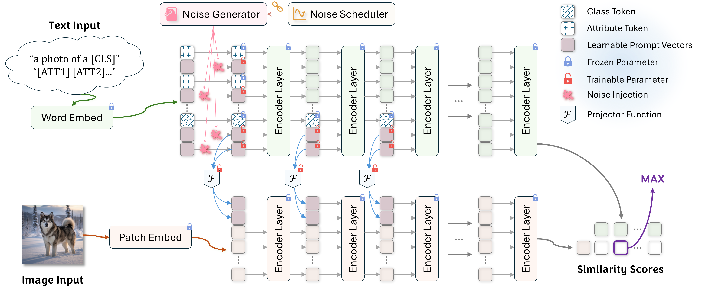

# **From Points to Clouds: Learning Robust Semantic Distributions for Multi-modal Prompts**

> If you find this project useful, a star 🌟 would be greatly appreciated!

## 📌 Updates

* **2025.11** — Initial project setup.

---

## 💡 Abstract

Most prompt-learning methods optimize a **single deterministic point** in the embedding space, which is brittle and sensitive to noise or distribution shift.
We introduce **P2C (Points-to-Clouds)**, a new framework that learns a **semantic cloud distribution** instead of a static prompt point.

P2C integrates:

* **GMM-based Dynamic Prompt Denoising (DPD)**
* **Visual–Language auxiliary reconstruction**
* **Dual-modality denoising objectives**

This encourages the model to learn a **robust semantic region** that generalizes well under input perturbations and multi-modal variations.

---

## 🧠 Key Contributions

### 🔹 1. Semantic Cloud Learning

Instead of a fixed point embedding, P2C models a **distribution (cloud)** capturing a robust semantic region.

### 🔹 2. Dynamic Prompt Denoising (DPD)

We perturb prompts using a **Gaussian Mixture Model (GMM)** with annealed scheduling.

### 🔹 3. Auxiliary Visual–Language Denoising

The V-L mapper is trained as a denoising autoencoder to reconstruct clean visual prompts from noisy text prompts.

---

## 🏛 Framework Overview

<div align="center">

</div>

**The P2C pipeline**

* GMM noise ➜ perturbed prompts
* Dual-modality denoising
* Semantic cloud learning
* Better representation robustness

---

## 📊 Performance

### **Base-to-Novel Generalization (Average over 11 datasets)**

| Method         | Base     | Novel    | HM       |
| -------------- | -------- | -------- | -------- |
| CoOp           | 82.7     | 63.2     | 71.7     |
| CoCoOp         | 80.5     | 71.7     | 75.8     |
| MaPLe          | 82.3     | 75.1     | 78.6     |
| **P2C (Ours)** | **83.5** | **76.1** | **79.7** |

---

## 🛠 Installation

### Clone the repo

```bash
git clone https://github.com/vranlee/P2C.git
cd P2C
```

### Install dependencies

```bash
conda create -n p2c python=3.8 -y
conda activate p2c
pip install -r requirements.txt
```

---

##  Core Implementation Preview

### **GMM Noise Generator**

```python
# From core.py: Implementation of GMM Noise Generator
class GaussianMixtureNoiseGenerator(nn.Module):
    def __init__(self, cfg, device):
        super().__init__()
        self.num_components = cfg.TRAINER.PROMPT_DENOISING.GMM_COMPONENTS
        self.gmm_means = cfg.TRAINER.PROMPT_DENOISING.GMM_MEANS
        self.gmm_stds = cfg.TRAINER.PROMPT_DENOISING.GMM_STDS

    def forward(self, tensor_like):
        mix = Categorical(self.mix_weights)
        comp = Normal(self.means, self.stds)
        gmm = MixtureSameFamily(mix, comp)

        noise = gmm.sample(tensor_like.shape)
        return noise.to(device=tensor_like.device, dtype=tensor_like.dtype)
```

### **Multi-modal Prompt Learner**

```python
class MultiModalPromptLearner(nn.Module):
    def forward(self, epoch=None, max_epoch=None):
        current_noise_scale = self._get_noise_scale(epoch, max_epoch)

        if current_noise_scale > 0:
            ctx = ctx + self._generate_noise(ctx, current_noise_scale)

        shared_ctx = self.proj(self.ctx)
        return prompts, shared_ctx
```

---

## 📦 Project Structure

```
Scheduled to be released after the arXiv version.
```

---

## 📜 Citation

```
Scheduled to be released after the arXiv version.
```